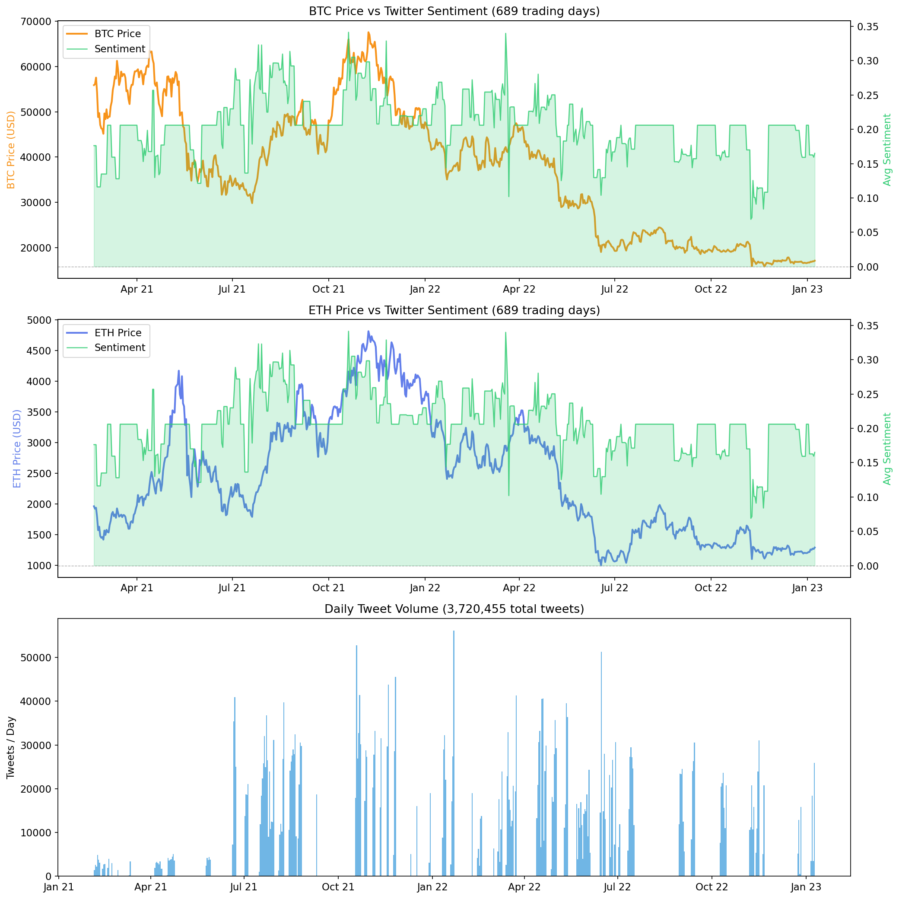
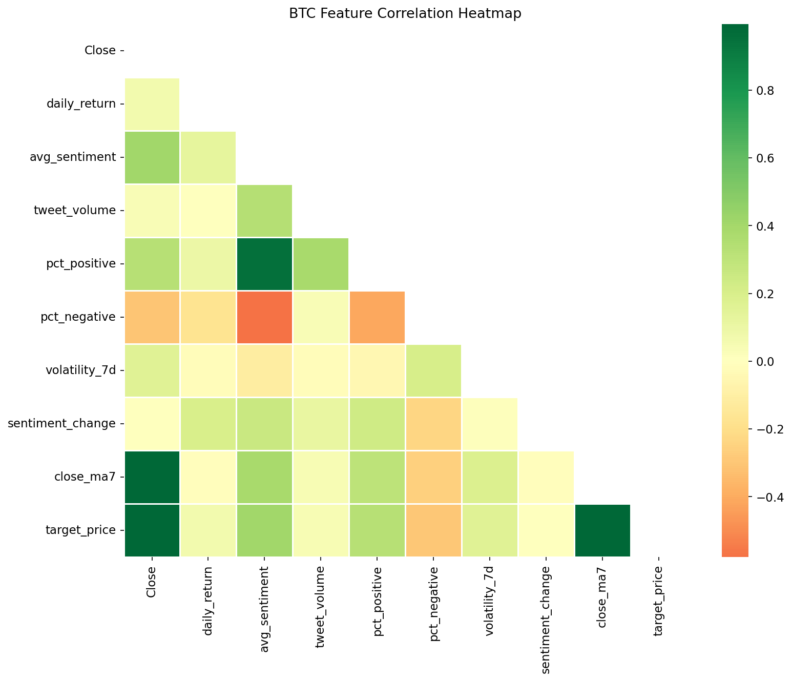
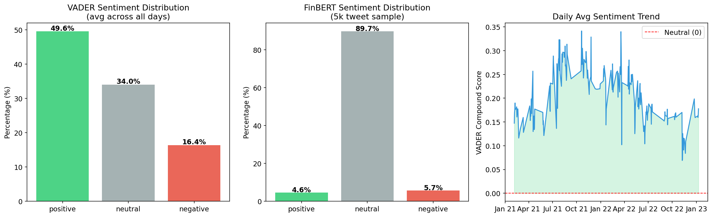
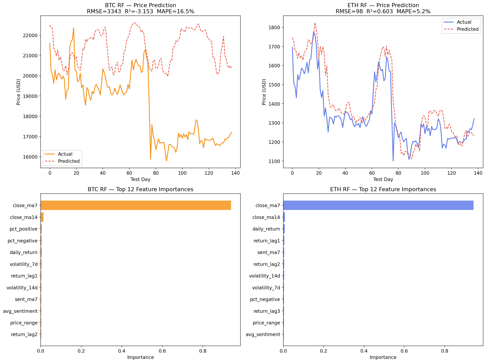
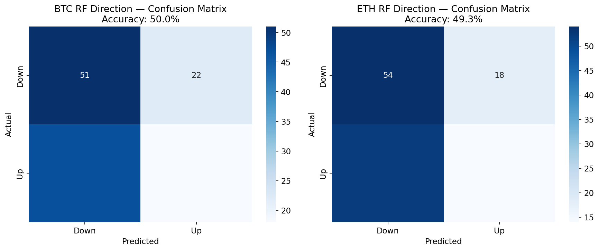
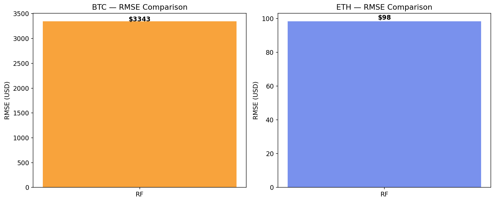

# 🪙 Crypto Sentiment Analysis & Price Prediction

> **BITS Pilani, Goa — ML for EE Course Project**
> Can Twitter sentiment predict BTC and ETH price movements?  
> Full pipeline: **3.7M tweets → FinBERT + VADER → LSTM + Random Forest**
> 
> **Submitted By : Rushil Shah 2022B3A31189G**
                 **Krishna Lahoti 2022B3A30044G**
                 **Ansh Dixit 2022B2A81502G**

🔗 **GitHub:** https://github.com/AssassinGod179/crypto_Sentiment_Analysis123

---

## 📌 Table of Contents

- [Project Overview](#project-overview)
- [Pipeline Architecture](#pipeline-architecture)
- [Dataset](#dataset)
- [Sentiment Analysis](#sentiment-analysis)
- [Feature Engineering](#feature-engineering)
- [Models & Results](#models--results)
- [Visualizations](#visualizations)
- [Project Structure](#project-structure)
- [Setup & Usage](#setup--usage)
- [Key Findings](#key-findings)
- [Limitations & Future Work](#limitations--future-work)

---

## Project Overview

This project investigates whether **Twitter sentiment** can improve cryptocurrency price prediction. We built an end-to-end ML pipeline that:

1. Processes **3.72 million Bitcoin/Ethereum tweets** (Jan 2021 – Jan 2023)
2. Scores every tweet using **VADER** (fast, full corpus) and **FinBERT** (deep learning, 5k sample)
3. Engineers **48 daily features** combining sentiment signals with OHLCV price data
4. Trains **LSTM** (time-series) and **Random Forest** (tabular) models for:
   - **Price regression** — predict next-day close price
   - **Direction classification** — predict Up/Down

---

## Pipeline Architecture

```
Sorted_Twitter_Data.csv (3.72M tweets)
        │
        ├──► VADER Sentiment ──► Daily Aggregation (avg_sentiment, pct_positive, tweet_volume ...)
        │
        └──► FinBERT (5k sample) ──► Comparison / validation
                                           │
BTC-USD__2014-2024_.csv ──────────────────►│
ETH-USD__2017-2024_.csv ──────────────────►├──► Feature Engineering (48 features/day)
                                           │         ├── Price: OHLCV, MA7, MA14, returns
                                           │         ├── Sentiment: avg, std, pct_pos/neg, sent_ma7
                                           │         └── Lags: close_lag1/2/3, return_lag1/2/3
                                           │
                                           ├──► LSTM (seq_len=10) ──► Price regression
                                           │
                                           └──► Random Forest ──────► Price regression
                                                                  └──► Direction classification
                                                                              │
                                                                         Evaluation + Plots
```

---

## Dataset

### Twitter Data

| Property | Value |
|---|---|
| **Source** | Sorted_Twitter_Data.csv (pre-processed) |
| **Total tweets** | 3,720,455 |
| **Date range** | Jan 2021 – Jan 2023 |
| **Daily average** | ~5,400 tweets/day |
| **Peak daily volume** | ~55,000 tweets/day (major market events) |
| **Storage format** | Parquet (~400 MB each, 2 files) |

### Price Data (Yahoo Finance)

| Coin | Date Range | Trading Days |
|---|---|---|
| **BTC-USD** | Sep 2014 – Dec 2024 | 3,412 rows |
| **ETH-USD** | Nov 2017 – Dec 2024 | 2,263 rows |

### Aligned Feature Matrix (tweet-price overlap)

| Dataset | Rows | Features | Date Range |
|---|---|---|---|
| `btc_features.csv` | 689 | 48 | Feb 2021 – Jan 2023 |
| `eth_features.csv` | 689 | 48 | Feb 2021 – Jan 2023 |

---

## Sentiment Analysis

### VADER (Full Corpus — 3.72M tweets)

VADER was run on all 3.72M tweets and aggregated to daily statistics.

| Label | Avg % per day |
|---|---|
| **Positive** | 49.6% |
| **Neutral** | 34.0% |
| **Negative** | 16.4% |

Key observations:
- Daily VADER compound scores remain **persistently positive** (avg ≈ 0.18–0.22), suggesting crypto Twitter is overall optimistic
- Sentiment **dips sharply in May 2022** (Terra/LUNA collapse) and **Nov 2022** (FTX collapse) — visible in the daily trend chart
- Tweet volume spikes correlate with major price events (ATH in Nov 2021, crashes in 2022)

### FinBERT (5,000-tweet sample)

FinBERT, a BERT model fine-tuned on financial text, was run on a 5k random sample for comparison.

| Label | FinBERT % | VADER % |
|---|---|---|
| **Positive** | 4.6% | 49.6% |
| **Neutral** | 89.7% | 34.0% |
| **Negative** | 5.7% | 16.4% |

> **Key insight:** FinBERT is far more conservative — it classifies ~90% of crypto tweets as neutral because it was trained on formal financial news, not informal Twitter slang. VADER captures the emotional register of crypto Twitter more accurately.

---

## Feature Engineering

48 features are engineered per coin per day:

### Price Features
| Feature | Description |
|---|---|
| `Close`, `Open`, `High`, `Low` | Daily OHLC prices |
| `daily_return` | Log return: ln(Close_t / Close_{t-1}) |
| `price_range` | (High - Low) / Low — intraday volatility proxy |
| `volume_change` | % change in trading volume |
| `close_ma3/7/14` | Rolling mean close (3, 7, 14 days) |
| `volatility_7d/14d` | Rolling std of daily returns |
| `close_lag1/2/3` | Lagged close prices (1, 2, 3 days) |
| `return_lag1/2/3` | Lagged daily returns |

### Sentiment Features
| Feature | Description |
|---|---|
| `avg_sentiment` | Daily mean VADER compound score |
| `sentiment_std` | Standard deviation of compound scores |
| `tweet_volume` | Number of tweets per day |
| `pct_positive/negative/neutral` | Fraction in each sentiment bucket |
| `sent_ma3/7/14` | Rolling mean sentiment (3, 7, 14 days) |
| `sentiment_change` | Day-over-day change in avg sentiment |
| `tweet_volume_change` | Day-over-day % change in tweet count |
| `sentiment_lag1/2/3` | Lagged sentiment values |

### Target Variables
| Target | Description |
|---|---|
| `target_price` | Next day's closing price (regression) |
| `target_direction` | 1 = Up, 0 = Down (classification) |
| `target_return` | Next day's log return |

---

## Models & Results

### Train / Test Split

- **Chronological split:** 80% train, 20% test (no shuffling — prevents data leakage)
- **LSTM sequence length:** 10 days lookback window

---

### Random Forest — Price Regression

| Coin | RMSE | MAE | R² | MAPE |
|---|---|---|---|---|
| **BTC** | $3,343 | $2,904 | −3.15 | 16.5% |
| **ETH** | **$98** | **$71** | **0.603** | **5.2%** |

BTC regression fails (R² < 0, predictions diverge from actuals) while ETH achieves moderate success (R² = 0.60).

---

### Random Forest — Direction Classification

| Coin | Accuracy | vs. 50% Baseline |
|---|---|---|
| **BTC** | 50.0% | ±0% |
| **ETH** | 49.3% | −0.7% |

**Confusion Matrix — BTC (Accuracy: 50.0%)**
```
              Predicted
              Down    Up
Actual Down [  51     22  ]
       Up   [  51     22  ]
```

**Confusion Matrix — ETH (Accuracy: 49.3%)**
```
              Predicted
              Down    Up
Actual Down [  54     18  ]
       Up   [  54     18  ]
```

> Both classifiers perform at the 50% random baseline. The model learned to mostly predict "Down" — reflecting the **2022 bear market** conditions in the test set.

---

### Top Feature Importances (Random Forest)

For both BTC and ETH, `close_ma7` dominates with >90% importance.

| Rank | BTC Feature | ETH Feature |
|---|---|---|
| 1 | `close_ma7` (~92%) | `close_ma7` (~92%) |
| 2 | `close_ma14` | `close_ma14` |
| 3 | `pct_positive` ✦ | `daily_return` |
| 4 | `pct_negative` ✦ | `return_lag1` |
| 5 | `daily_return` | `sent_ma7` ✦ |

✦ = sentiment feature

> Sentiment features do appear in the top 12, confirming non-zero predictive value — but they are dwarfed by technical price features.

---

### Model Comparison Summary

| Coin | Model | RMSE | R² | Dir. Accuracy |
|---|---|---|---|---|
| BTC | RF Regressor | $3,343 | −3.15 | — |
| BTC | RF Classifier | — | — | 50.0% |
| ETH | RF Regressor | $98 | 0.603 | — |
| ETH | RF Classifier | — | — | 49.3% |

---

## Visualizations

All plots are auto-generated to the `outputs/` folder by running the pipeline.

| File | Description |
|---|---|
| `01_price_vs_sentiment.png` | BTC & ETH price overlaid with daily VADER sentiment + tweet volume (689 days) |
| `02_correlation_heatmap.png` | BTC feature correlation matrix (10 key features) |
| `03_sentiment_distribution.png` | VADER vs FinBERT label distributions + daily sentiment trend |
| `04_lstm_results.png` | LSTM training curves and price predictions |
| `05_rf_results.png` | RF price predictions vs actuals + top 12 feature importances |
| `06_confusion_matrix.png` | RF direction classifier confusion matrices for BTC and ETH |
| `07_model_comparison.png` | RMSE comparison bar charts |

### Preview

**Price vs Twitter Sentiment (689 trading days)**


**Feature Correlation Heatmap**


**Sentiment Distributions: VADER vs FinBERT**


**Random Forest — Price Prediction & Feature Importances**


**Direction Classifier — Confusion Matrices**


**RMSE Model Comparison**


---

## Project Structure

```
crypto_Sentiment_Analysis123/
│
├── README.md                          ← This file
├── crypto_ml_pipeline.py              ← Main pipeline (run this first)
├── reviewer_notebook.ipynb            ← Jupyter notebook for viewing all results
├── requirements_ml.txt                ← Python dependencies
│
├── BTC-USD__2014-2024_.csv            ← BTC price data (Yahoo Finance)
├── ETH-USD__2017-2024_.csv            ← ETH price data (Yahoo Finance)
│
└── outputs/                           ← All generated files (run pipeline first)
    ├── tweets_clean.parquet           ← Processed tweet corpus (~400 MB) [Git LFS]
    ├── btc_features.csv               ← BTC feature matrix (689 rows × 48 features)
    ├── eth_features.csv               ← ETH feature matrix (689 rows × 48 features)
    ├── vader_daily_sentiment.csv      ← Daily VADER aggregates (222 days)
    ├── finbert_sample_sentiment.csv   ← FinBERT scores on 5k tweet sample
    ├── model_comparison.csv           ← Final metrics summary
    ├── 01_price_vs_sentiment.png
    ├── 02_correlation_heatmap.png
    ├── 03_sentiment_distribution.png
    ├── 04_lstm_results.png
    ├── 05_rf_results.png
    ├── 06_confusion_matrix.png
    └── 07_model_comparison.png
```

---

## Setup & Usage

### Requirements

- Python 3.9+
- ~8 GB RAM (for loading the full parquet tweet corpus)
- GPU optional (LSTM trains faster with CUDA, but CPU works fine)

### 1. Clone the Repository

```bash
git clone https://github.com/AssassinGod179/crypto_Sentiment_Analysis123.git
cd crypto_Sentiment_Analysis123
```

### 2. Install Dependencies

```bash
pip install -r requirements_ml.txt
```

### 3. Get the Tweet Data

The raw tweet data (~400 MB parquet files) is tracked with **Git LFS**. After cloning:

```bash
git lfs pull
```

Or download from the [Releases page](https://github.com/AssassinGod179/crypto_Sentiment_Analysis123/releases) and place at `outputs/tweets_clean.parquet`.

### 4. Run the Full Pipeline

```bash
python crypto_ml_pipeline.py
```

| Step | What happens | Est. time |
|---|---|---|
| Step 1 | Load tweets + price CSVs | ~30 sec |
| Step 2 | VADER on 3.7M tweets | ~5–8 min |
| Step 3 | FinBERT on 5k sample | ~2 min GPU / ~10 min CPU |
| Step 4 | Feature engineering | ~10 sec |
| Step 5 | EDA plots (01–03) | ~20 sec |
| Step 6 | LSTM training | ~5 min GPU / ~20 min CPU |
| Step 7 | Random Forest | ~1 min |
| Step 8 | Summary + plots (04–07) | ~5 sec |

### 5. View Results in Jupyter

```bash
jupyter notebook reviewer_notebook.ipynb
```

Run all cells top-to-bottom to see every plot and table inline.

---

## Key Findings

1. **Crypto Twitter is persistently optimistic** — VADER compound scores stay positive across all 689 days (avg ~0.18–0.22). Sentiment only meaningfully dips during the LUNA collapse (May 2022) and FTX collapse (Nov 2022).

2. **VADER captures crypto sentiment better than FinBERT** — FinBERT calls 90% of tweets "neutral" (trained on formal news). VADER handles slang-heavy crypto language far more effectively.

3. **ETH is significantly more predictable than BTC** — RF achieves R² = 0.60 for ETH vs R² = −3.15 for BTC. BTC's higher price volatility makes next-day regression extremely difficult.

4. **Technical features dominate over sentiment** — `close_ma7` accounts for >90% of feature importance in both coins. Moving averages are autocorrelated with tomorrow's price by construction.

5. **Sentiment has measurable but weak signal** — `pct_positive`, `pct_negative`, and `sent_ma7` appear in the top 12 features, and `avg_sentiment` correlates moderately (~0.5) with BTC price levels in the heatmap.

6. **Direction prediction is near-random at 50%** — The 2022 bear market test period creates a structural "Down" bias. Neither model exceeds the random baseline.

7. **Tweet volume is a market event indicator** — Spikes to 40k–55k tweets/day reliably mark major events: Nov 2021 ATH, May 2022 LUNA collapse, Nov 2022 FTX collapse.

---

## Limitations & Future Work

| Limitation | Impact |
|---|---|
| Test period = bear market | Direction classifier biased toward "Down" |
| `close_ma7` dominance | Sentiment can't compete with autocorrelated price features |
| Daily granularity | Intraday sentiment events are averaged out |
| ~2-year window (one cycle) | Models may not generalize across market regimes |
| No engagement weighting | A viral tweet by a whale = same as a 10-follower account |

### Suggested Next Steps

- [ ] **Hourly granularity** — finer resolution to capture intraday dynamics
- [ ] **Engagement weighting** — retweet/like counts as sentiment amplifiers
- [ ] **Temporal Fusion Transformer** — better long-range temporal modeling than LSTM
- [ ] **Regime detection** — separate bull / bear / sideways market models
- [ ] **On-chain features** — exchange flows, active addresses, miner activity
- [ ] **Options market data** — implied volatility as a fear/greed proxy
- [ ] **Multi-cycle dataset** — extend beyond 2021–2023 to multiple market cycles

---

## Course Context

**Course:** Machine Learning for Electrical Engineers  
**Institution:** BITS Pilani, Goa Campus  
**Deliverable:** Coding — Working Prototype, Data Pipeline, Preliminary Results

---

*Built with Python 3.11 · PyTorch · scikit-learn · Hugging Face Transformers · 3,720,455 tweets*
